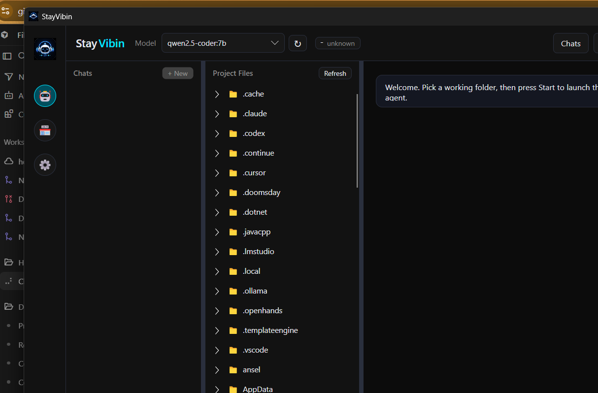

# StayVibin

A native desktop (Avalonia / .NET 10) app for local-first AI vibe coding.

StayVibin launches its own bundled AI engine as a child process and talks to it
over REST + WebSocket. That keeps the engine, tools, model integrations, and
streaming local while giving you a real native desktop app.

This project is standalone and intentionally separate from the HCDE build and
release pipeline. It is built on the upstream MIT-licensed OpenHands.



## How it works

```
+-------------------+        REST: POST /api/conversations        +------------------+
|  StayVibin        |  ----------------------------------------->  |  agent-server    |
|  (C#/Avalonia)    |        WebSocket: /sockets/events/{id}       |  (Python,        |
|                   |  <-----------------------------------------  |   localhost:8000)|
+-------------------+        live events / messages               +------------------+
                                                                      |
                                                                      v
                                                            StayVibin Engine / LLM
```

- `Services/BackendManager.cs` - locates and launches `agent-server.exe`, waits
  for the `/health` endpoint, and tears the process down on exit.
- `Services/AgentSpecProvider.cs` - creates/reuses the agent config at
  `~/.openhands/agent_settings.json` and sets tool-calling behavior for local
  models.
- `Services/AgentServerClient.cs` - creates a conversation over REST and streams
  events over the WebSocket, normalizing them into render-ready updates.
- `Services/StayVibinEngineManager.cs` - owns the bundled engine process: launch,
  health, context/device sizing, model-runner cleanup, and teardown.
- `MainWindow.axaml` / `.cs` - the single-window UI: chat (messages, thoughts,
  tool calls, results), the Model Store, Settings, status, and a server log panel.

## Prerequisites

1. **.NET 10 SDK** (to build) - the runtime is bundled when you publish.
2. **StayVibin AI engine** - StayVibin installs this for you automatically the
   first time you press **Start** (it installs `uv` if needed, then installs the
   engine package). To do it manually instead:
   ```
   uv tool install openhands --python 3.12
   ```
   The app expects `agent-server.exe` at
   `%APPDATA%\uv\tools\openhands\Scripts\agent-server.exe` (override in Settings).
3. **No separate Ollama install required.** StayVibin ships and manages its own
   bundled engine (an Ollama-compatible fork) on `127.0.0.1:11500`. You do not
   need stock Ollama installed; if you have it, StayVibin still uses its own engine.
4. **A model** - pull one from the in-app **Model Store** (e.g. `qwen3:14b`). On
   first launch StayVibin configures the bundled engine for you automatically.

> Note: the agent-server, sdk, and tools packages must be version-compatible.
> This repo was validated against `openhands-sdk==1.21.0` /
> `openhands-tools==1.21.0` with `openhands-agent-server==1.21.0`.

## Run (development)

```
dotnet run
```

## Build a distributable .exe

```
powershell -ExecutionPolicy Bypass -File .\publish.ps1
```

Produces a self-contained single-file executable at:

```
bin\Release\net10.0\win-x64\publish\StayVibin.exe
```

## Build the Windows installer (v2.0+)

```
powershell -ExecutionPolicy Bypass -File .\build-installer.ps1
```

This publishes a self-contained `StayVibin.exe` and compiles a full setup wizard using
Inno Setup 6 (downloaded automatically if it is not already installed). Output:

```
dist\StayVibin-<version>-setup.exe
```

The installer adds Start menu and Add/Remove Programs entries. Optional desktop shortcut.
It does **not** bundle Ollama. Install Ollama separately (see Prerequisites);
StayVibin sets up its own AI engine on first run.

Download the latest release from
[GitHub Releases](https://github.com/bokoxthexchocobo/StayVibin/releases).

## Using it

1. Press **Folder** to choose the working directory the agent operates in.
2. Press **Start** - the app launches the backend, waits for health, creates a
   conversation, and connects.
3. Type a task and press **Enter** (Shift+Enter for a newline). **Stop**
   interrupts a running agent.

## Current scope (v2.0)

- Single conversation per session, with Start/Stop, Interrupt, and Steer.
- Renders user/assistant messages, agent thoughts, tool calls, results, errors.
- Model dropdown sourced from local Ollama, with hot-swap mid-session and a
  refresh button to pick up newly pulled models instantly.
- Auto-tunes temperature / reasoning / context per selected model (toggleable).
- Token + context usage strip with manual and automatic compaction.
- Model capability strip (chat / tools / vision / etc.) with tooltips.
- Attachments: the `+` button, drag-and-drop, and screenshot paste; images are
  shown to vision-capable models, videos are frame-sampled when ffmpeg is present.
- Settings window for connection, model, and behavior; settings/logs live under
  `%APPDATA%\StayVibin`.
- Live token streaming is rendered if the backend emits it; otherwise the final
  message is shown when the turn completes.

## What's new in v3.0.0

A major release: the whole UI was rebuilt and the engine/model experience was
reworked around the bundled StayVibin Engine.

- **New Avalonia UI.** Migrated from WPF to a single-window Avalonia app with a
  compact cyber-neon theme. Chat, Model Store, and Settings now live in one
  window with a left sidebar (Settings, Git status, Server log toggle).
- **Cursor-style context ring.** The context meter is a circular gauge that fills
  as the window is used and keeps the live `used / total` numbers beside it. Click
  it to compact (summarize) the conversation on demand; auto-compaction is a
  toggle in Settings.
- **VRAM/RAM-aware automatic context tuning.** The context window is sized to your
  actual hardware and the model: it fits the KV cache in VRAM for full speed, and
  when VRAM is tight it borrows a bounded slice of system RAM to reach a usable
  working window instead of cramming into the leftover VRAM. The engine is
  relaunched at the resolved window so the meter, the engine, and every request
  agree on one size. A manual "Max context" in Settings always overrides.
- **Token-aware auto-compaction.** History is summarized based on real token count
  (not just event count) with headroom reserved for the reply and for a large tool
  output, which stops the engine from truncating the prompt mid-session.
- **Compute device choice.** Run models on GPU (default) or CPU only, with a
  recommended-hardware note for CPU mode. Switching relaunches the engine.
- **Model Store as a marketplace.** ~110 models with honest descriptions,
  capability tags, grouping with installed models on top, and a "Recommended for
  your hardware" hint. An in-form **Installed models** manager lists what you have
  with on-disk sizes, a running total, and per-model delete.
- **Live engine telemetry in the GUI.** Tokens this turn, decode speed (t/s), and
  prefill progress are parsed from the engine and shown live next to the meter.
- **Standard Tool Kit (tool translator).** A translation layer maps the many
  tool-name and argument-name dialects local models emit onto StayVibin's real
  tools, so more models can actually drive the agent. File-read and search limits
  were raised and workspace awareness broadened (key files + folder map) so the
  agent explores like a frontier model instead of guessing.
- **Plain-text thinking.** Agent reasoning shows as plain text under an animated
  "Assistant is thinking..." header (Cursor-style) instead of a bubble.
- **Engine lifecycle hardening.** The app adopts an already-running engine so it
  can always shut it down, sweeps orphaned `llama-server` runners by path, and no
  longer leaves the engine "stuck" running after close. The model stays warm on
  **Stop** (instant restart) and is freed when you switch models, change the
  context/device, or close the app.
- **AMD note.** VRAM detection is vendor-neutral, but the bundled engine currently
  accelerates NVIDIA (CUDA); AMD cards fall back to CPU. The fitter still tailors
  the window to detected memory.
- **Reliability fixes.** Duplicated tool-call arguments from the engine's
  OpenAI-compatible layer, stale/stuck conversation handling, chat bottom cut-off
  (including fullscreen), and a stale publish path that broke `publish.ps1` are all
  fixed.

## What's new in v2.0.0

- Bundled StayVibin Engine support: the app launches its own modified local engine
  by default instead of relying on a separately managed Ollama instance.
- Improved tool-call reliability for local models through the new engine
  integration, safer engine lifecycle management, and model-aware tuning.
- Search/tooling fixes for agent investigations, including grep/glob behavior
  that previously caused local models to miss obvious code paths.
- Conversation persistence, model guidance, capability-aware defaults, and
  broader reliability fixes across startup, model loading, and session control.

## What's new in v1.0.2

- Context cap now supports "auto": leave Settings -> "Max context" blank and
  AutoTune uses each model's native window; with AutoTune off it defaults to 32k.
  Enter a number to force a specific size.
- The context meter updates immediately when you change the cap in Settings (no
  restart needed) and always reflects the configured runtime window.
- Server log expander sits flush with the window bottom when collapsed - the empty
  gap under it is gone; expanding restores a resizable, draggable log panel.

## What's new in v1.0.1

- Model dropdown refresh button - newly pulled Ollama models appear without a restart.
- Context window now adapts per model up to a user-set ceiling (Settings -> "Max
  context"); raise it for more context, lower it to save RAM. Default 64K.
- Step-by-step narration of agent actions (Run command, Read/Edit/Create file,
  Plan, ...) instead of a generic tool line.
- Leaked tool-call markup (`<function=...>`) is stripped from assistant messages.
- Reliability: model metadata no longer caches transient failures, model loading
  is serialized, session teardown no longer blocks the UI, and external command
  helpers read stdout/stderr concurrently to avoid pipe-buffer deadlocks.

## License

StayVibin is released under the MIT License (Modified with Ethical AI Use Clause) -
see [LICENSE](LICENSE). In short: standard MIT permissions, plus an ethical-use
restriction that prohibits using the Software to cause intentional harm (e.g.
disinformation, non-consensual deepfakes, phishing, autonomous weapons, malicious
cyber-attacks or surveillance, or any illegal activity). Breaching that clause
automatically voids the license.

This project is built on the upstream MIT-licensed OpenHands, which retains its
own license.
